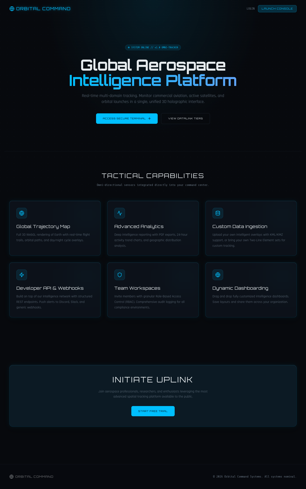
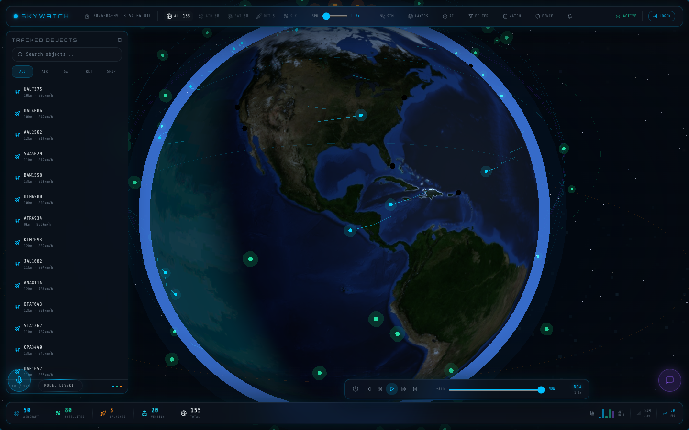
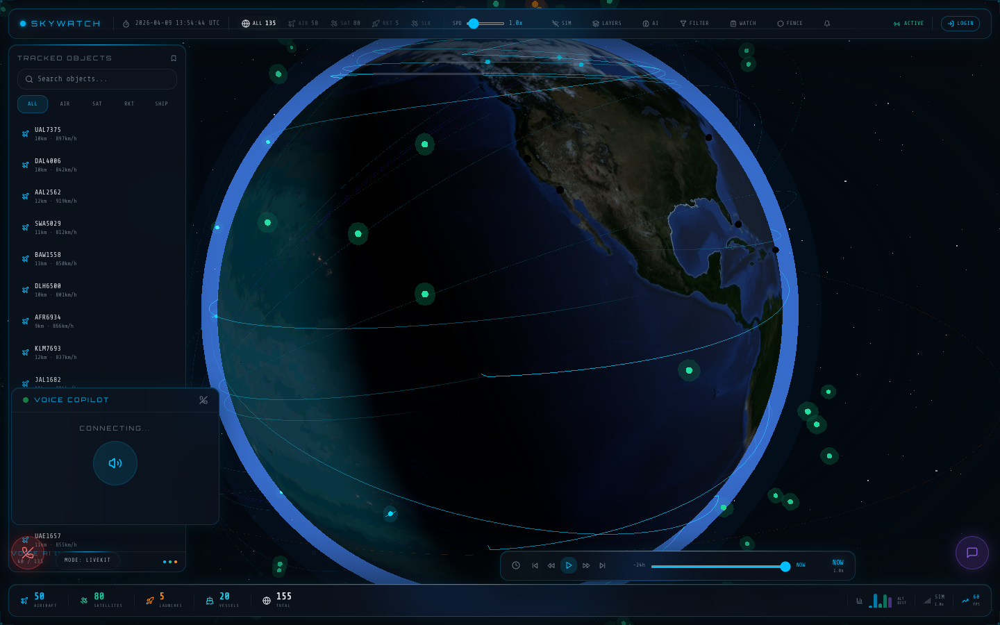

# Quantum Earth

[](https://github.com/johnmatveyev-lab/quantum-earth/actions/workflows/ci.yml)

Real-time 3D aerospace intelligence and tracking platform with voice AI.

## Screenshots




## Highlights
- Live 3D globe visualization for aircraft, satellites, rockets, and vessels
- Layered environmental overlays (night lights, infrared, clouds, precipitation, etc.)
- AI insights panel and voice copilot experience
- Supabase-backed Edge Functions for data, auth, and alerts
- LiveKit voice mode with optional xAI realtime mode

## Architecture
- **Frontend:** React + Vite + TypeScript + Tailwind
- **3D/Maps:** Three.js + @react-three/fiber
- **State:** Zustand
- **Backend:** Supabase (Auth, DB, Edge Functions)
- **Voice:** LiveKit (primary), xAI realtime (optional)

## Quick Start
```bash
npm install
npm run dev
```

Open `http://localhost:8081/app` if port 8080 is already in use.

## Environment
Copy `.env.example` to `.env` and fill in keys.

Required (minimum for local UI):
- `VITE_SUPABASE_URL`
- `VITE_SUPABASE_PUBLISHABLE_KEY`
- `VITE_GOOGLE_MAPS_API_KEY`

Voice integrations:
- LiveKit: `LIVEKIT_API_KEY`, `LIVEKIT_API_SECRET`, `LIVEKIT_URL`
- xAI (optional): `VITE_XAI_API_KEY` or use the Supabase `xai-token` function

## Voice Modes
The app includes a **Voice Mode switcher**:
- **LiveKit (default):** Works with Supabase `livekit-token`
- **xAI (optional):** Uses `xai-token` for ephemeral client secrets

## Supabase Edge Functions
- `livekit-token` — generates LiveKit room tokens
- `xai-token` — fetches xAI ephemeral tokens for realtime WebSocket auth
- `opensky-proxy`, `celestrak-proxy`, `spacex-proxy` — data proxies
- `ai-briefing`, `ai-copilot`, `ai-analyze` — AI features

## Tests
```bash
npx vitest run
```

## Roadmap
- Add mission replay timelines with shareable links
- Add team workspaces, roles, and audit logging
- Expand anomaly detection and collision prediction

## Deployment Notes
- Ensure Supabase secrets are configured.
- Update LiveKit and xAI keys in Supabase if you enable voice.
- Vercel or Firebase hosting are supported in this repo.

## Security
- `.env` is excluded from version control.
- Do not commit private API keys.

## License
MIT
